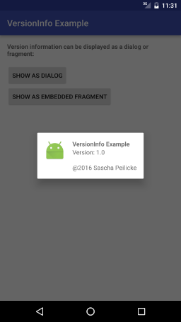
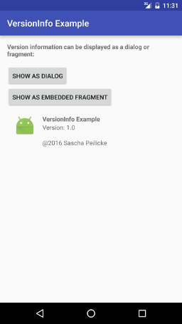

# VersionInfo
[  ](https://bintray.com/saschpe/maven/android-versioninfo/_latestVersion)
[](http://android-arsenal.com/details/1/3832)
[](http://www.apache.org/licenses/LICENSE-2.0.html)

All about activities have a version info widget somewhere. This library provides one that can be
used as a dialog or fragment. It honors default styling rules, Material-style:





# Usage
Allows to either display a version information dialog:

```java
VersionInfoDialogFragment
        .newInstance(
                getString(R.string.app_name),
                BuildConfig.VERSION_NAME,
                "Sascha Peilicke",
                R.mipmap.ic_launcher)
        .show(getFragmentManager(), "version_info");
```

Or a fragment:

```java
DialogFragment fragment = VersionInfoDialogFragment.newInstance(
        getString(R.string.app_name),
        BuildConfig.VERSION_NAME,
        "Sascha Peilicke",
        R.mipmap.ic_launcher);
getFragmentManager().beginTransaction().replace(R.id.container, fragment).commit();
```

Check out the sample app in `app/` to see it in action.


# Download
```groovy
compile 'saschpe.android:versioninfo:1.2.3'
```

Snapshots of the development version are available in [Sonatype's `snapshots` repository][snap].


# License

    Copyright 2016 Sascha Peilicke

    Licensed under the Apache License, Version 2.0 (the "License");
    you may not use this file except in compliance with the License.
    You may obtain a copy of the License at

       http://www.apache.org/licenses/LICENSE-2.0

    Unless required by applicable law or agreed to in writing, software
    distributed under the License is distributed on an "AS IS" BASIS,
    WITHOUT WARRANTIES OR CONDITIONS OF ANY KIND, either express or implied.
    See the License for the specific language governing permissions and
    limitations under the License.


 [snap]: https://oss.sonatype.org/content/repositories/snapshots/
